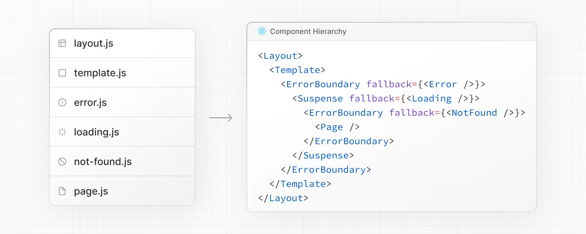
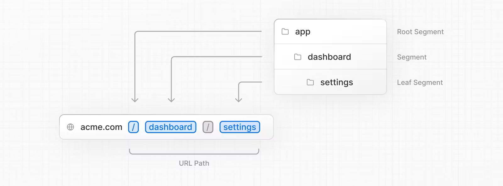
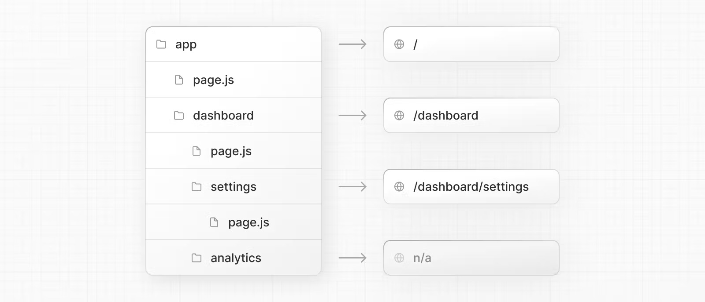
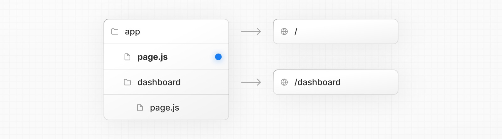
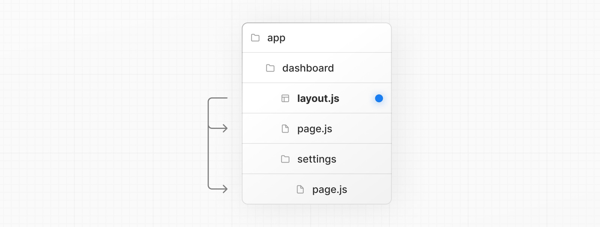

# Nextjs (Routing Fundamentals)

## Routing types

- ```app``` routing
- ```pages``` routing

I'll focus on ```app``` routing.

## File Conventions

|file|description|
|---|---|
|```layout```|Shared UI for a segment and its children|
|```page```|Unique UI of a route and make routes publicly accessible|
|```loading```|Loading UI for a segment and its children|
|```not-found```|Not found UI for a segment and its children|
|```error```|Error UI for a segment and its children|
|```global-error```|Global Error UI|
|```route```|Server-side API endpoint|
|```template```|Specialized re-rendered Layout UI|
|```default```|Fallback UI for Parallel Routes|

## Component Hierarchy

The React components defined in special files of a route segment are rendered in a specific hierarchy:
- ```layout```
- ```template```
- ``` error```
- ```loading```
- ```not-found```
- ```page``` or nested ```layout```



## Advanced Routing Patterns

- Parallel Routes
- Intercepting Routes

## Creating Routes

Next.js uses a file-system based router where folders are used to define routes.

Each folder represents a route segment that maps to a URL segment. To create a nested route, you can nest folders inside each other.

A special ```page.ts``` file is used to make route segments publicly accessible.





## Creating UI

Special file conventions are used to create UI for each route segment. The most common are pages to show UI unique to a route, and layouts to show UI that is shared across multiple routes.

For example, to create your first page, add a page.js file inside the app directory and export a React component:

```tsx
export default function Page() {
  return <h1>Hello, Next.js!</h1>
}
```

## Pages

A page is UI that is unique to a route. You can define a page by default exporting a component from a page.js file.

For example, to create your index page, add the page.js file inside the app directory:



## Layouts

- UI that is shared between multiple routes.
- On navigation, layouts preserve state, remain interactive, and do nt re-render.
- Layouts can be nested.
- A layout can be defined by default exporting a react component from a ```layout.ts` file.
- The component should accept a ```children``` prop that will be populated with a child layout (if it exists) or a page during rendering.

For example, the layout will be shared with the /dashboard and /dashboard/settings pages:



```tsx
// app/dashboard/layout.tsx
export default function DashboardLayout({
  children, // will be a page or nested layout
}: {
  children: React.ReactNode
}) {
  return (
    <section>
      {/* Include shared UI here e.g. a header or sidebar */}
      <nav></nav>
 
      {children}
    </section>
  )
}
```

## Root Layut (Required)

The root layout is defined at the top level of the app directory and applies to all routes. This layout is required and must contain ```html``` and ```body``` tags, allowing you to modify the initial HTML returned from the server.

```tsx
export default function RootLayout({
  children,
}: {
  children: React.ReactNode
}) {
  return (
    <html lang="en">
      <body>
        {/* Layout UI */}
        <main>{children}</main>
      </body>
    </html>
  )
}
```

## Nesting Layouts

By default, layouts in the folder hierarchy are nested, which means they wrap child layouts via their children prop. You can nest layouts by adding layout.js inside specific route segments (folders).

## Templates

- Mostly same as ```layout```.
- Don't preserve state.
- Create a new instance for each of their child on navigation.

A template can be defined by exporting a default React component from a ```template.ts``` file. The component should accept a children prop.


```tsx
export default function Template({ children }: { children: React.ReactNode }) {
  return <div>{children}</div>
}
```

In terms of nesting, template.js is rendered between a layout and its children. Here's a simplified output:

```tsx
<Layout>
  {/* Note that the template is given a unique key. */}
  <Template key={routeParam}>{children}</Template>
</Layout>
```

## Metadata

In the app directory, you can modify the <head> HTML elements such as title and meta using the Metadata APIs.

Metadata can be defined by exporting a metadata object or generateMetadata function in a ```layout.ts``` or ```page.ts``` file.

```tsx
import { Metadata } from 'next'
 
export const metadata: Metadata = {
  title: 'Next.js',
}
 
export default function Page() {
  return '...'
}
```

## Linking and Navigating

There are four ways to navigaute between routes in Next.js:
- ```<Link>``` Component
- ```useRouter``` hook (Client Components)
- ```redirect``` function (Server Components)
- ```History``` API

## ```<Link>``` Component

- extends HTML ```<a>```.
- Provide prefetching and client-side navigation between routrs.
- Primary and recommended way to navigate between routes in Next.js

```tsx
import Link from 'next/link'
 
export default function Page() {
  return <Link href="/dashboard">Dashboard</Link>
}
```
### Linking to Dynamic Segment

```tsx
import Link from 'next/link'
 
export default function PostList({ posts }) {
  return (
    <ul>
      {posts.map((post) => (
        <li key={post.id}>
          <Link href={`/blog/${post.slug}`}>{post.title}</Link>
        </li>
      ))}
    </ul>
  )
}
```

### Checking Active Links, ```usePathname()```

```tsx
'use client'
 
import { usePathname } from 'next/navigation'
import Link from 'next/link'
 
export function Links() {
  const pathname = usePathname()
 
  return (
    <nav>
      <ul>
        <li>
          <Link className={`link ${pathname === '/' ? 'active' : ''}`} href="/">
            Home
          </Link>
        </li>
        <li>
          <Link
            className={`link ${pathname === '/about' ? 'active' : ''}`}
            href="/about"
          >
            About
          </Link>
        </li>
      </ul>
    </nav>
  )
}
```

### Scrolling to an ```id```

```tsx
<Link href="/dashboard#settings">Settings</Link>
 
// Output
<a href="/dashboard#settings">Settings</a>
```

### Disabling scroll restoration

```tsx
// next/link
<Link href="/dashboard" scroll={false}>
  Dashboard
</Link>
```

```tsx
// useRouter
import { useRouter } from 'next/navigation'
 
const router = useRouter()
 
router.push('/dashboard', { scroll: false })
```

## ```useRouter()``` hook

The ```useRouter```

The useRouter hook allows you to programmatically change routes from Client Components.

```tsx
'use client'
 
import { useRouter } from 'next/navigation'
 
export default function Page() {
  const router = useRouter()
 
  return (
    <button type="button" onClick={() => router.push('/dashboard')}>
      Dashboard
    </button>
  )
}
```

## ```redirect``` function

For Server Components, use the redirect function instead.

```tsx
import { redirect } from 'next/navigation'
 
async function fetchTeam(id: string) {
  const res = await fetch('https://...')
  if (!res.ok) return undefined
  return res.json()
}
 
export default async function Profile({ params }: { params: { id: string } }) {
  const team = await fetchTeam(params.id)
  if (!team) {
    redirect('/login')
  }
 
  // ...
}
```

## ```History``` API

Next.js allows you to use the native ```window.history.pushState``` and ```window.history.replaceState``` methods to update the browser's history stack without reloading the page.

```pushState``` and ```replaceState``` calls integrate into the Next.js Router, allowing you to sync with ```usePathname``` and ```useSearchParams```.

### ```window.history.pushState```

```tsx
'use client'
 
import { useSearchParams } from 'next/navigation'
 
export default function SortProducts() {
  const searchParams = useSearchParams()
 
  function updateSorting(sortOrder: string) {
    const params = new URLSearchParams(searchParams.toString())
    params.set('sort', sortOrder)
    window.history.pushState(null, '', `?${params.toString()}`)
  }
 
  return (
    <>
      <button onClick={() => updateSorting('asc')}>Sort Ascending</button>
      <button onClick={() => updateSorting('desc')}>Sort Descending</button>
    </>
  )
}
```

### ```window.history.replaceState```

Use it to replace the current entry on the browser's history stack. The user is not able to navigate back to the previous state. For example, to switch the application's locale:

```tsx
'use client'
 
import { usePathname } from 'next/navigation'
 
export function LocaleSwitcher() {
  const pathname = usePathname()
 
  function switchLocale(locale: string) {
    // e.g. '/en/about' or '/fr/contact'
    const newPath = `/${locale}${pathname}`
    window.history.replaceState(null, '', newPath)
  }
 
  return (
    <>
      <button onClick={() => switchLocale('en')}>English</button>
      <button onClick={() => switchLocale('fr')}>French</button>
    </>
  )
}
```
