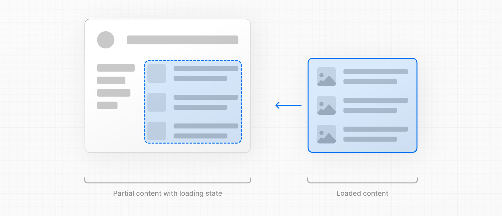
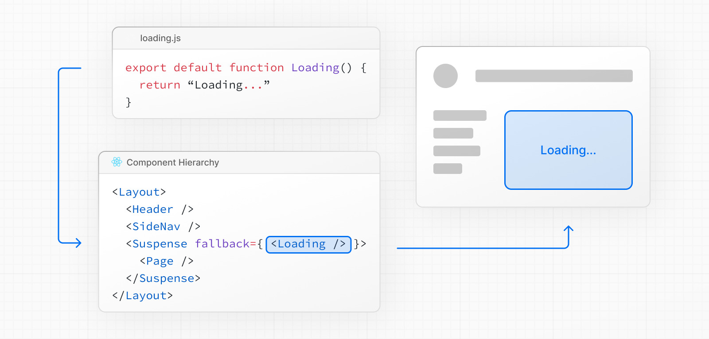
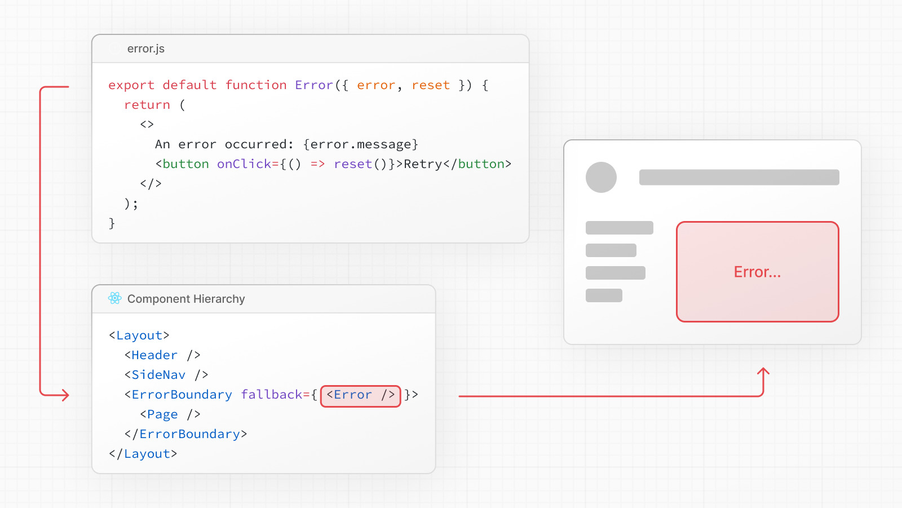
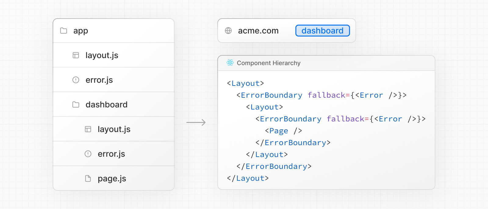
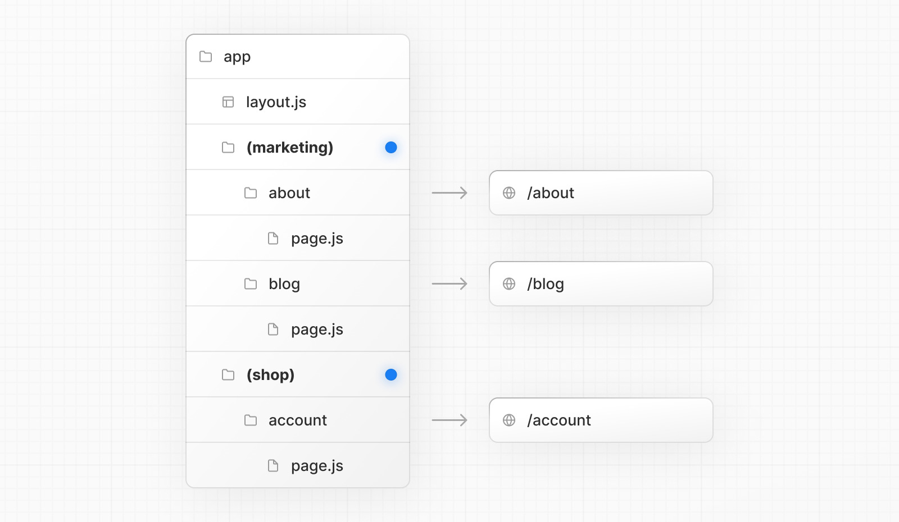
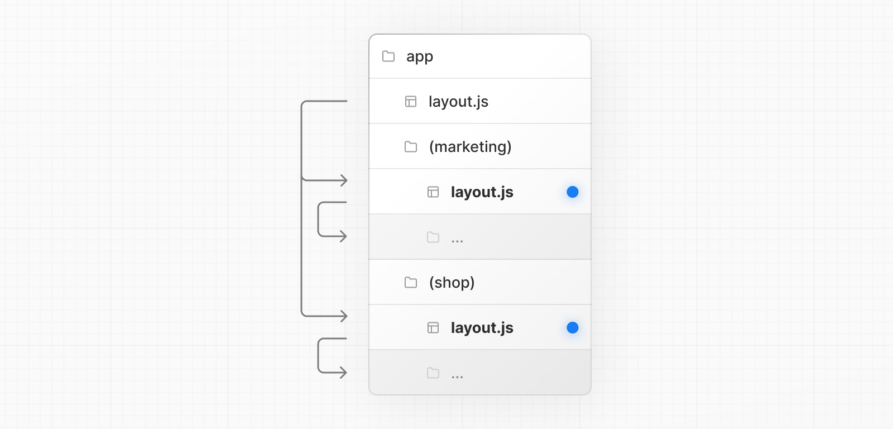
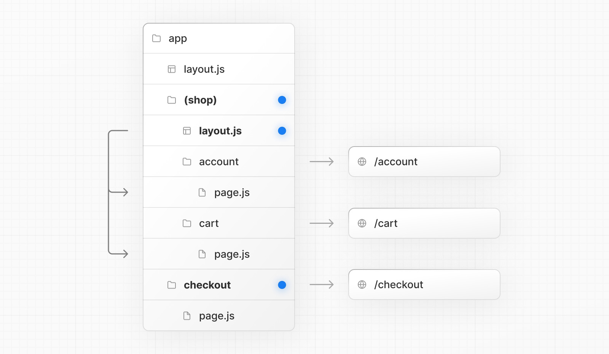
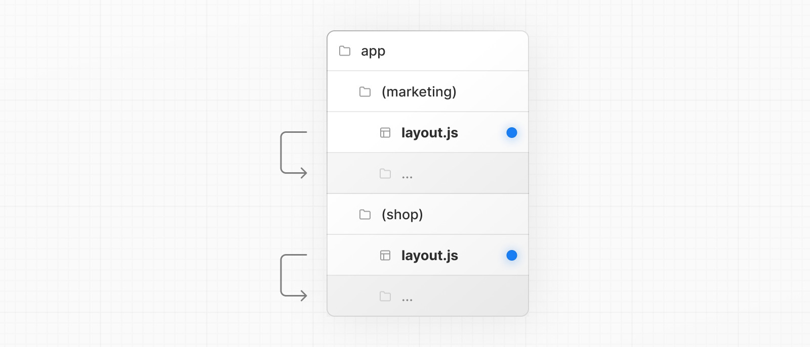

# Nextjs (Routing Fundamentals)

## Routing types

- ```app``` routing
- ```pages``` routing

I'll focus on ```app``` routing.

## File Conventions

|file|description|
|---|---|
|```layout```|Shared UI for a segment and its children|
|```page```|Unique UI of a route and make routes publicly accessible|
|```loading```|Loading UI for a segment and its children|
|```not-found```|Not found UI for a segment and its children|
|```error```|Error UI for a segment and its children|
|```global-error```|Global Error UI|
|```route```|Server-side API endpoint|
|```template```|Specialized re-rendered Layout UI|
|```default```|Fallback UI for Parallel Routes|

## Component Hierarchy

The React components defined in special files of a route segment are rendered in a specific hierarchy:
- ```layout```
- ```template```
- ``` error```
- ```loading```
- ```not-found```
- ```page``` or nested ```layout```


## Advanced Routing Patterns

- Parallel Routes
- Intercepting Routes

## Creating Routes

Next.js uses a file-system based router where folders are used to define routes.

Each folder represents a route segment that maps to a URL segment. To create a nested route, you can nest folders inside each other.

A special ```page.ts``` file is used to make route segments publicly accessible.


## Creating UI

Special file conventions are used to create UI for each route segment. The most common are pages to show UI unique to a route, and layouts to show UI that is shared across multiple routes.

For example, to create your first page, add a page.js file inside the app directory and export a React component:

```tsx
export default function Page() {
  return <h1>Hello, Next.js!</h1>
}
```

## Pages

A page is UI that is unique to a route. You can define a page by default exporting a component from a page.js file.

For example, to create your index page, add the page.js file inside the app directory:


## Layouts

- UI that is shared between multiple routes.
- On navigation, layouts preserve state, remain interactive, and do nt re-render.
- Layouts can be nested.
- A layout can be defined by default exporting a react component from a ```layout.ts` file.
- The component should accept a ```children``` prop that will be populated with a child layout (if it exists) or a page during rendering.

For example, the layout will be shared with the /dashboard and /dashboard/settings pages:


```tsx
// app/dashboard/layout.tsx
export default function DashboardLayout({
  children, // will be a page or nested layout
}: {
  children: React.ReactNode
}) {
  return (
    <section>
      {/* Include shared UI here e.g. a header or sidebar */}
      <nav></nav>
 
      {children}
    </section>
  )
}
```

## Root Layut (Required)

The root layout is defined at the top level of the app directory and applies to all routes. This layout is required and must contain ```html``` and ```body``` tags, allowing you to modify the initial HTML returned from the server.

```tsx
export default function RootLayout({
  children,
}: {
  children: React.ReactNode
}) {
  return (
    <html lang="en">
      <body>
        {/* Layout UI */}
        <main>{children}</main>
      </body>
    </html>
  )
}
```

## Nesting Layouts

By default, layouts in the folder hierarchy are nested, which means they wrap child layouts via their children prop. You can nest layouts by adding layout.js inside specific route segments (folders).

## Templates

- Mostly same as ```layout```.
- Don't preserve state.
- Create a new instance for each of their child on navigation.

A template can be defined by exporting a default React component from a ```template.ts``` file. The component should accept a children prop.


```tsx
export default function Template({ children }: { children: React.ReactNode }) {
  return <div>{children}</div>
}
```

In terms of nesting, template.js is rendered between a layout and its children. Here's a simplified output:

```tsx
<Layout>
  {/* Note that the template is given a unique key. */}
  <Template key={routeParam}>{children}</Template>
</Layout>
```

## Metadata

In the app directory, you can modify the <head> HTML elements such as title and meta using the Metadata APIs.

Metadata can be defined by exporting a metadata object or generateMetadata function in a ```layout.ts``` or ```page.ts``` file.

```tsx
import { Metadata } from 'next'
 
export const metadata: Metadata = {
  title: 'Next.js',
}
 
export default function Page() {
  return '...'
}
```

## Linking and Navigating

There are four ways to navigaute between routes in Next.js:
- ```<Link>``` Component
- ```useRouter``` hook (Client Components)
- ```redirect``` function (Server Components)
- ```History``` API

## ```<Link>``` Component

- extends HTML ```<a>```.
- Provide prefetching and client-side navigation between routrs.
- Primary and recommended way to navigate between routes in Next.js

```tsx
import Link from 'next/link'
 
export default function Page() {
  return <Link href="/dashboard">Dashboard</Link>
}
```
### Linking to Dynamic Segment

```tsx
import Link from 'next/link'
 
export default function PostList({ posts }) {
  return (
    <ul>
      {posts.map((post) => (
        <li key={post.id}>
          <Link href={`/blog/${post.slug}`}>{post.title}</Link>
        </li>
      ))}
    </ul>
  )
}
```

### Checking Active Links, ```usePathname()```

```tsx
'use client'
 
import { usePathname } from 'next/navigation'
import Link from 'next/link'
 
export function Links() {
  const pathname = usePathname()
 
  return (
    <nav>
      <ul>
        <li>
          <Link className={`link ${pathname === '/' ? 'active' : ''}`} href="/">
            Home
          </Link>
        </li>
        <li>
          <Link
            className={`link ${pathname === '/about' ? 'active' : ''}`}
            href="/about"
          >
            About
          </Link>
        </li>
      </ul>
    </nav>
  )
}
```

### Scrolling to an ```id```

```tsx
<Link href="/dashboard#settings">Settings</Link>
 
// Output
<a href="/dashboard#settings">Settings</a>
```

### Disabling scroll restoration

```tsx
// next/link
<Link href="/dashboard" scroll={false}>
  Dashboard
</Link>
```

```tsx
// useRouter
import { useRouter } from 'next/navigation'
 
const router = useRouter()
 
router.push('/dashboard', { scroll: false })
```

## ```useRouter()``` hook

The ```useRouter```

The useRouter hook allows you to programmatically change routes from Client Components.

```tsx
'use client'
 
import { useRouter } from 'next/navigation'
 
export default function Page() {
  const router = useRouter()
 
  return (
    <button type="button" onClick={() => router.push('/dashboard')}>
      Dashboard
    </button>
  )
}
```

## ```redirect``` function

For Server Components, use the redirect function instead.

```tsx
import { redirect } from 'next/navigation'
 
async function fetchTeam(id: string) {
  const res = await fetch('https://...')
  if (!res.ok) return undefined
  return res.json()
}
 
export default async function Profile({ params }: { params: { id: string } }) {
  const team = await fetchTeam(params.id)
  if (!team) {
    redirect('/login')
  }
 
  // ...
}
```

## ```History``` API

Next.js allows you to use the native ```window.history.pushState``` and ```window.history.replaceState``` methods to update the browser's history stack without reloading the page.

```pushState``` and ```replaceState``` calls integrate into the Next.js Router, allowing you to sync with ```usePathname``` and ```useSearchParams```.

### ```window.history.pushState```

```tsx
'use client'
 
import { useSearchParams } from 'next/navigation'
 
export default function SortProducts() {
  const searchParams = useSearchParams()
 
  function updateSorting(sortOrder: string) {
    const params = new URLSearchParams(searchParams.toString())
    params.set('sort', sortOrder)
    window.history.pushState(null, '', `?${params.toString()}`)
  }
 
  return (
    <>
      <button onClick={() => updateSorting('asc')}>Sort Ascending</button>
      <button onClick={() => updateSorting('desc')}>Sort Descending</button>
    </>
  )
}
```

### ```window.history.replaceState```

Use it to replace the current entry on the browser's history stack. The user is not able to navigate back to the previous state. For example, to switch the application's locale:

```tsx
'use client'
 
import { usePathname } from 'next/navigation'
 
export function LocaleSwitcher() {
  const pathname = usePathname()
 
  function switchLocale(locale: string) {
    // e.g. '/en/about' or '/fr/contact'
    const newPath = `/${locale}${pathname}`
    window.history.replaceState(null, '', newPath)
  }
 
  return (
    <>
      <button onClick={() => switchLocale('en')}>English</button>
      <button onClick={() => switchLocale('fr')}>French</button>
    </>
  )
}
```

## Loading UI and Streaming

The special file ```loading.ts``` healps you create meaningful loading UI with React Suspense. With the convention, you can show an instant loading state froom the server while the content of a route segment loads. The new contect is automatically swapped in once rendering is complete.



### Instant Loading States

An instant loading state is fallback UI that is shown immediately upon navigation. You can pre-render loading indicators such as skeletons and spinners, or a small but meaningful part of future screens such as a cover photo, title, etc. This helps users understand the app is responding and provides a better user experience.

Create a loading state by adding a loading.js file inside a folder.


```tsx
export default function Loading() {
  // You can add any UI inside Loading, including a Skeleton.
  return <LoadingSkeleton />
}
```

In the same folder, ```loading.ts``` will be nested inside ```layout.ts```. It will automatically wrap the ```page.ts``` file and any children below in a ```<Suspense>``` boundary.



### Server Side Rendering (SSR)
- First, all data for a given page is fetched on the server.
- The server then render the HTML for the page.
- The HTML, CSS, and JavaScript for the page is sent to the cllient.
- A non-interactive user interface is shown using the generated HTML, and CSS.
- Finally, React hydrates the use interface to make it interactive.

### Rendering Terms
- TTFB: Time TO First Byte.
- FCP: First Contentful Paint.
- TTI: Time To Interactive.

### Streaming with Suspense

In addition to loading.js, you can also manually create Suspense Boundaries for your own UI components. The App Router supports streaming with Suspense for both Node.js and Edge runtimes.

```tsx
import { Suspense } from 'react'
import { PostFeed, Weather } from './Components'
 
export default function Posts() {
  return (
    <section>
      <Suspense fallback={<p>Loading feed...</p>}>
        <PostFeed />
      </Suspense>
      <Suspense fallback={<p>Loading weather...</p>}>
        <Weather />
      </Suspense>
    </section>
  )
}
```

Using Suspense benefits:
- **Streaming Server Rendering**: Progressively rendering HTML from the server to the client.
- **Selective Hydration**: React prioritizes what components to make interactive first based on user interaction.

## Error Handling

The ```error.ts``` file convention allows to gracefully handle unexpected runtime errors in nested routes.
- Automatically wrap a route segment and its nested children in a React Error Boundary.
- Create error UI tailored to specific segments using the file-system hierarchy to adjust granularity.
- Isolate errors to affected segments while keeping the rest of the application functional.
- Add functionality to attempt to recover from an error without a full page reload.

Create error UI by adding an error.js file inside a route segment and exporting a React component:


```tsx
'use client' // Error components must be Client Components
 
import { useEffect } from 'react'
 
export default function Error({
  error,
  reset,
}: {
  error: Error & { digest?: string }
  reset: () => void
}) {
  useEffect(() => {
    // Log the error to an error reporting service
    console.error(error)
  }, [error])
 
  return (
    <div>
      <h2>Something went wrong!</h2>
      <button
        onClick={
          // Attempt to recover by trying to re-render the segment
          () => reset()
        }
      >
        Try again
      </button>
    </div>
  )
}
```





```error.ts``` boundaries do not catch errors thrown in ```layout.ts``` or ```template.ts``` components of the same segment. This intentional hierarchy keeps important UI that is shared between sibling routes (such as navigation) visible and functional when an error occurs.

To handle errors within a specific layout or template, place an ```error.ts``` file in the layout's parent segment.

To handle errors within the root layout or template, use a variation of ```error.ts``` called ```global-error.ts```.

```global-error.ts``` must define its own ```<html>``` and ```<body>``` tags.

```tsx
'use client'
 
export default function GlobalError({
  error,
  reset,
}: {
  error: Error & { digest?: string }
  reset: () => void
}) {
  return (
    <html>
      <body>
        <h2>Something went wrong!</h2>
        <button onClick={() => reset()}>Try again</button>
      </body>
    </html>
  )
}
```

### Handling Server Errors

If an error is thrown inside a Server Component, Next.js will forward an ```Error``` object (stripped of sensitive error information in production) to the nearest ```error.ts``` file as the ```error``` prop.

## Redirecting

|API|Perpose|Where|Status Code|
|---|---|---|---|
|```redirect```|Redirect user after a mutation or event|Server Components, Server Actions, Route Handlers|307 (Temporary) or 303 (Server Action)|
|```permanentRedirect```|Redirect user after a mutation or event|Server Components, Server Actions, Route Handlers|308 (Permanent)|
|```useRouter```|Perform a client-side navigation|Event Handlers in Client Components|N/A|
|```redirects in next.config.js```|Redirect an incoming request based on a path|```next.config.js``` file|307 (Temporary) or 308 (Permanent)|
|```NextResponse.redirect```|Redirect an incoming request based on a condition|Middleware|Any|

### ```redirect``` function

```tsx
'use server'
 
import { redirect } from 'next/navigation'
import { revalidatePath } from 'next/cache'
 
export async function createPost(id: string) {
  try {
    // Call database
  } catch (error) {
    // Handle errors
  }
 
  revalidatePath('/posts') // Update cached posts
  redirect(`/post/${id}`) // Navigate to the new post page
}
```

### ```permanentRedirect``` function

```tsx
'use server'
 
import { permanentRedirect } from 'next/navigation'
import { revalidateTag } from 'next/cache'
 
export async function updateUsername(username: string, formData: FormData) {
  try {
    // Call database
  } catch (error) {
    // Handle errors
  }
 
  revalidateTag('username') // Update all references to the username
  permanentRedirect(`/profile/${username}`) // Navigate to the new user profile
}
```

### ```useRouter()``` hook

```tsx
'use client'
 
import { useRouter } from 'next/navigation'
 
export default function Page() {
  const router = useRouter()
 
  return (
    <button type="button" onClick={() => router.push('/dashboard')}>
      Dashboard
    </button>
  )
}
```

### ```redirects``` in ```next.config.js```

```redirects``` supports ```path```, ```header```, ```cookie```, and ```query matching```, giving you the flexibility to redirect users based on an incoming request.

```tsx
module.exports = {
  async redirects() {
    return [
      // Basic redirect
      {
        source: '/about',
        destination: '/',
        permanent: true,
      },
      // Wildcard path matching
      {
        source: '/blog/:slug',
        destination: '/news/:slug',
        permanent: true,
      },
    ]
  },
}
```

### ```NextResponse.redirect``` in Middleware

```tsx
import { NextResponse, NextRequest } from 'next/server'
import { authenticate } from 'auth-provider'
 
export function middleware(request: NextRequest) {
  const isAuthenticated = authenticate(request)
 
  // If the user is authenticated, continue as normal
  if (isAuthenticated) {
    return NextResponse.next()
  }
 
  // Redirect to login page if not authenticated
  return NextResponse.redirect(new URL('/login', request.url))
}
 
export const config = {
  matcher: '/dashboard/:path*',
}
```

#### Creating and storing a redirect map

A redirect map is a list of redirects that you can store in a database (usually a key-value store) or JSON file.

```tsx
{
  "/old": {
    "destination": "/new",
    "permanent": true
  },
  "/blog/post-old": {
    "destination": "/blog/post-new",
    "permanent": true
  }
}
```

## Route Groups

In the app directory, nested folders are normally mapped to URL paths. However, you can mark a folder as a Route Group to prevent the folder from being included in the route's URL path. A route group can be created by wrapping a folder's name in parenthesis: ```(folderName)```

### Organize routes without affecting the URL path



Even though routes inside ```(marketing)``` and ```(shop)``` share the same URL hierarchy, you can create a different layout for each group by adding a ```layout.ts``` file inside their folders.



### Opting specific segments into a layout

To opt specific routes into a layout, create a new route group (e.g. ```(shop)```) and move the routes that share the same layout into the group (e.g. ```account``` and ```cart```). The routes outside of the group will not share the layout (e.g. ```checkout```).



### Creating multiple root layouts



